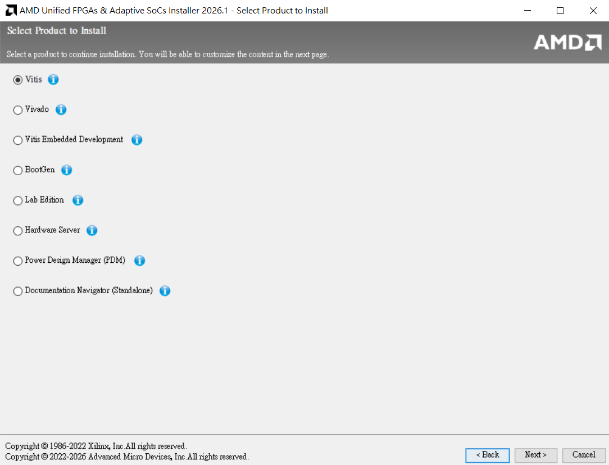
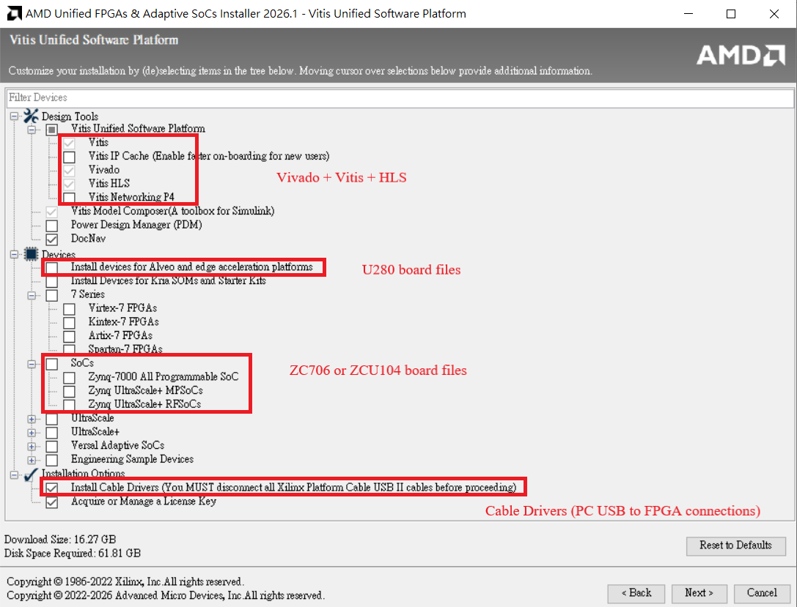
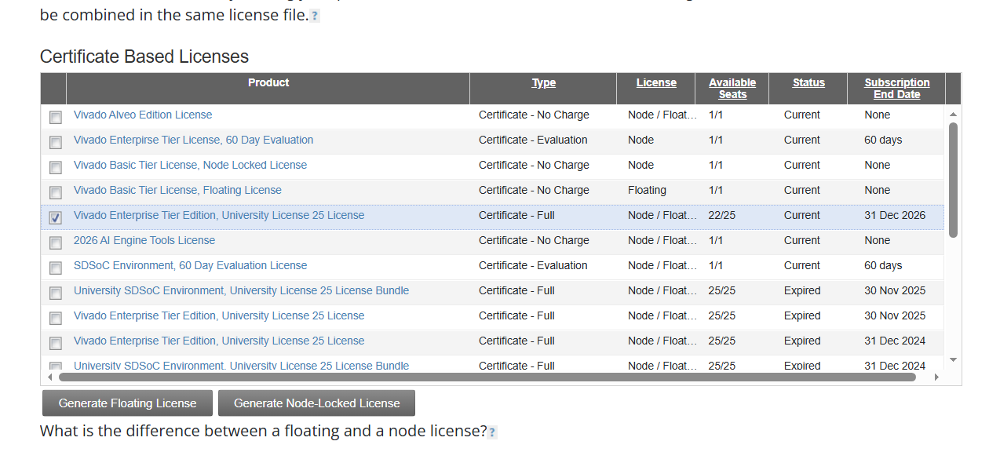
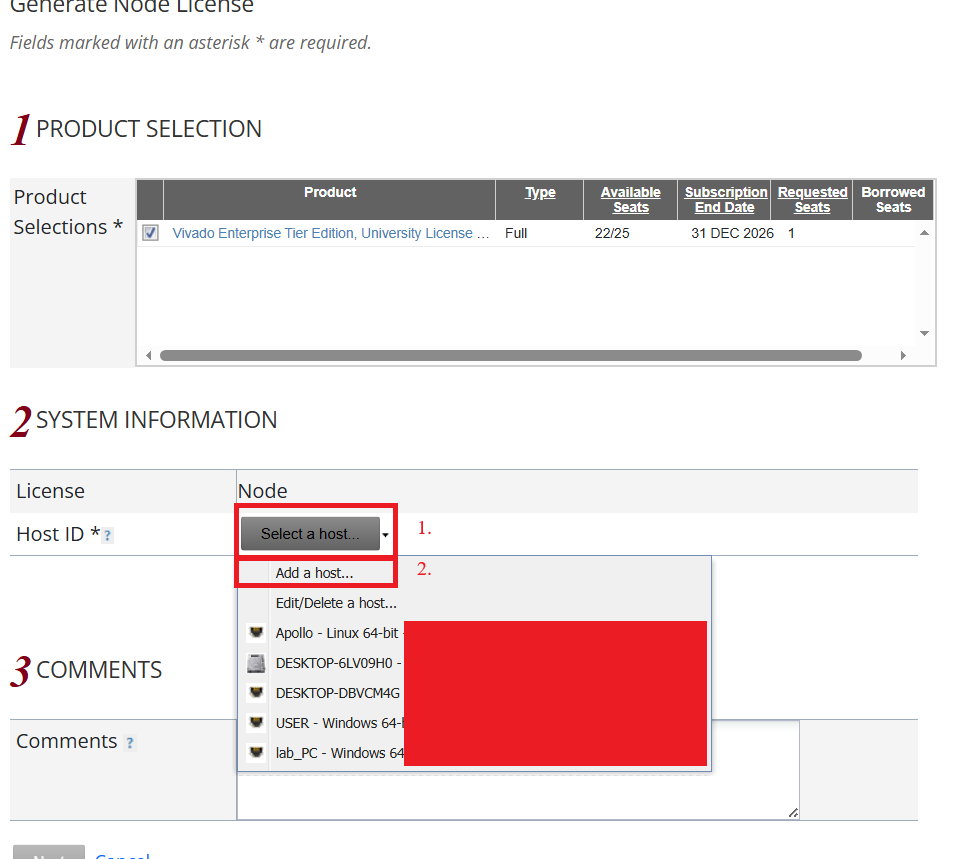
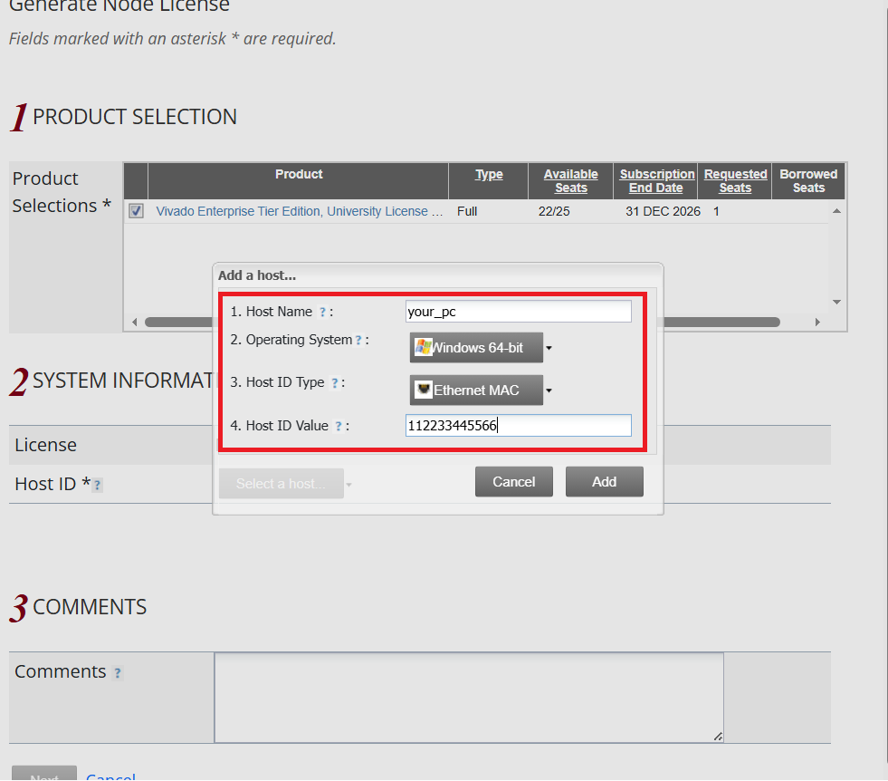
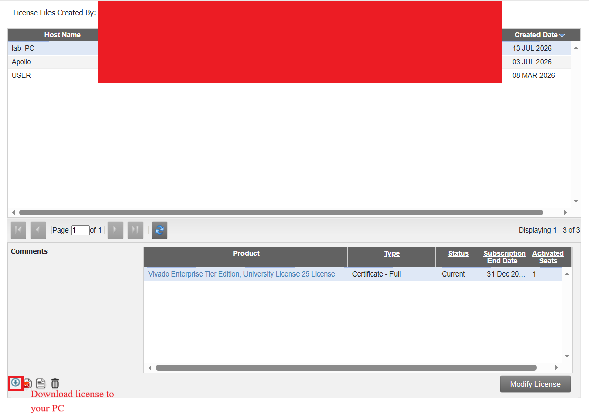
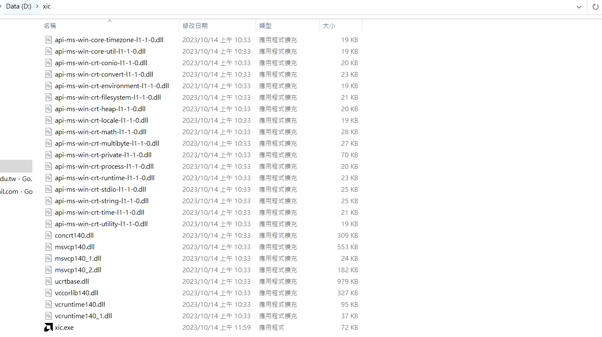

# Step1.
Sign up an account at [AMD website](https://www.amd.com/en.html)

# Step2.
Download Vivado from [AMD Download](https://www.xilinx.com/support/download.html/content/xilinx/en/downloadNav/vivado-design-tools/archive.html)
Above 2023.2 use AMD Unified Installer

Select Vitis for download Vivado + Vitis + Vivado HLS, remeber no any chinese or symbols at installation paths
  

Select board files or you can add specify board files at "C:\Xilinx\Vivado\2023.2\data\xhub\boards\XilinxBoardStore\boards\Xilinx" (take 2023.2 for instance)
  

# Step3.
Remember to renew teacher AMD University Program for yearly license
Manage license (if you want to use ZC706, ZCU104 but PYNQ-z2, PYNQ-ZU, KV260, Alveo Series(U280) don't need license) [License](https://account.amd.com/en/forms/license/license-form.html)

Select license and click float/fix license (take fix license for example)
  

Add a host
  

Key in address
  

Download license!!!
  

Open license manager
  
